# 🎓 Academic Intelligence Hub  
## AI-Powered Student Performance Analysis Dashboard

> A premium full-stack academic analytics platform that transforms student marks into intelligent insights, performance trends, AI-generated study plans, leaderboard rankings, and downloadable reports.

---

## 🚀 Project Overview

**Academic Intelligence Hub** is a modern Student Performance Analysis Dashboard built using **Streamlit, FastAPI, MongoDB Atlas, Plotly, and Gemini AI**.

It helps faculty/admins manage student records, enter marks, analyze academic performance, detect weak subjects, generate AI-powered study recommendations, view leaderboards, and export reports in CSV and PDF formats.

---

## ✨ Key Highlights

- 🎓 Student Management System  
- 📝 Marks Entry and Performance Calculation  
- 📊 Interactive Analytics Dashboard  
- 🤖 Gemini AI Academic Advisor  
- 🏆 Academic Leaderboard  
- 👤 Student Profile View  
- 📈 Performance Trends  
- 📄 CSV and PDF Report Export  
- 🔔 Academic Notifications  
- 👨‍💼 Admin Control Center  
- ⚙️ Theme and Settings Page  
- ☁️ MongoDB Atlas Cloud Database  
- ⚡ FastAPI Backend  
- 🎨 Premium SaaS-style Streamlit UI  

---

## 🧠 Core Features

| Module | Description |
|---|---|
| Dashboard | Shows total students, class average, top score, risk students, charts and insights |
| Students | Add, view and search student records |
| Marks | Enter subject marks and generate grade, average, risk level and subject analysis |
| Analytics | Visualize academic performance using charts |
| AI Advisor | Generates personalized study plans using Gemini AI |
| Leaderboard | Ranks students based on average score |
| Profile | Displays individual student performance profile |
| Trends | Shows performance comparison and academic trends |
| Reports | Exports student and marks data as CSV |
| PDF Reports | Generates downloadable student performance reports |
| Notifications | Shows academic alerts and risk updates |
| Admin | Displays system overview and platform summary |

---

## 🛠️ Tech Stack

| Layer | Technology |
|---|---|
| Frontend | Streamlit |
| Backend | FastAPI |
| Database | MongoDB Atlas |
| AI Engine | Google Gemini AI |
| Charts | Plotly |
| Reports | ReportLab, CSV |
| Authentication | JWT |
| Language | Python |
| IDE | VS Code |
| Version Control | Git & GitHub |

---

## 🏗️ System Architecture

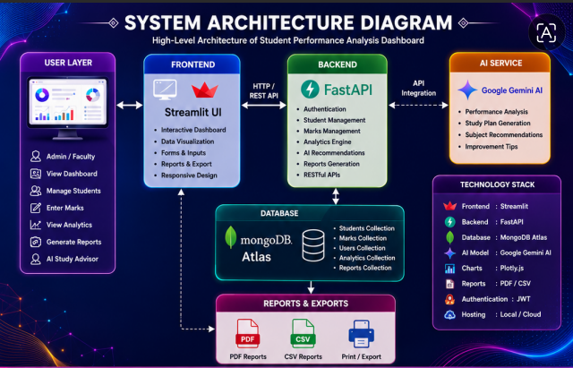

---

## 🧩 ER Diagram

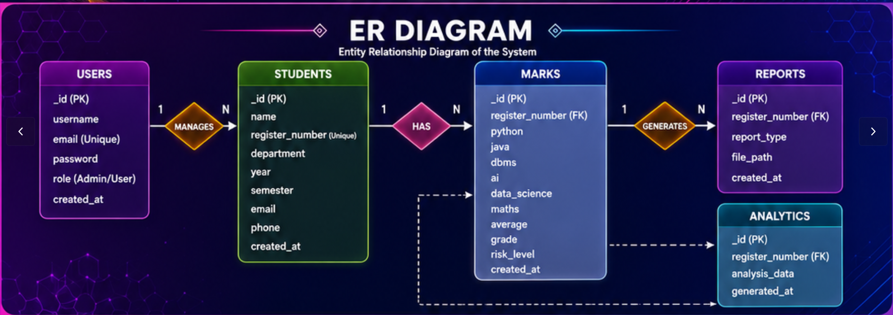

---

## 🎯 Use Case Diagram

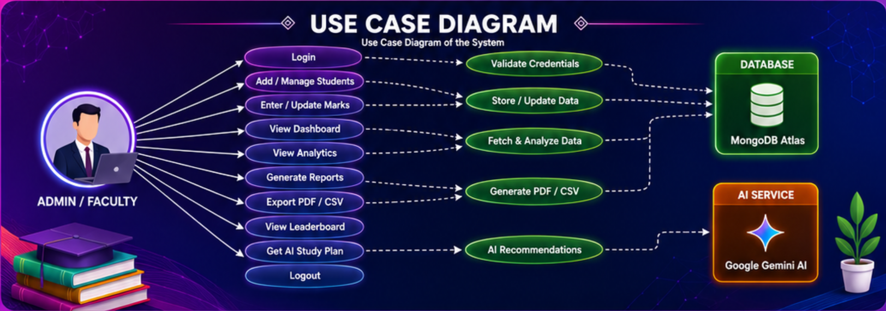

---

## 📸 Screenshots

### 🏠 Dashboard
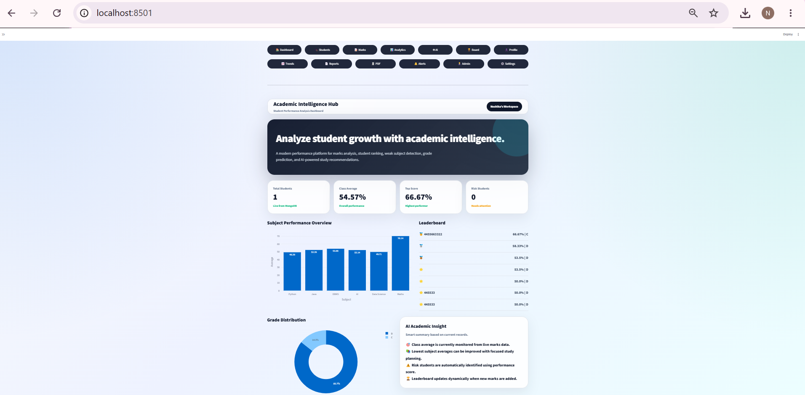

### 🎓 Student Directory
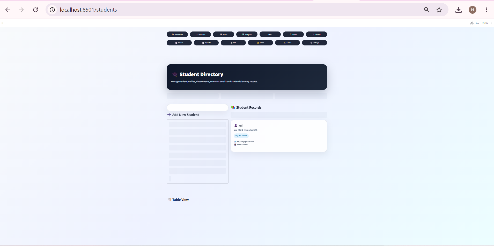

### 📝 Marks Intelligence
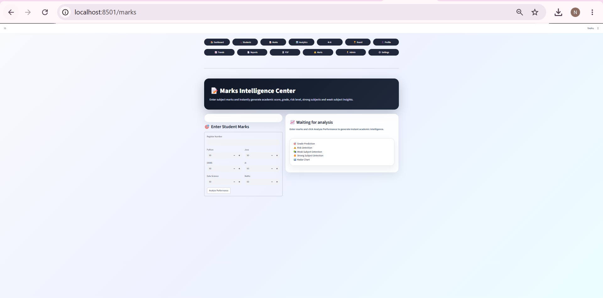

### 📊 Analytics
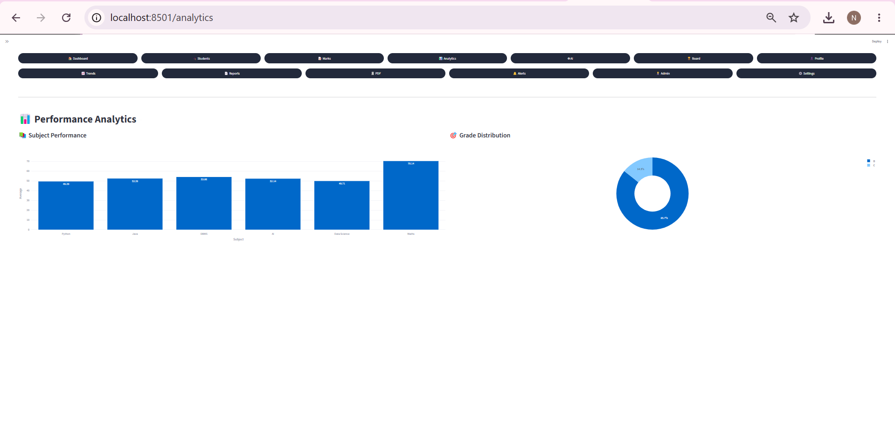

### 🤖 AI Academic Advisor


### 🏆 Leaderboard
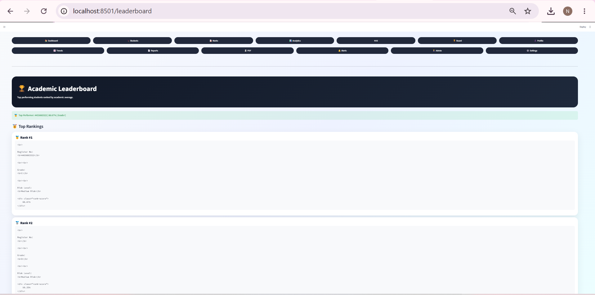

### 👤 Student Profile
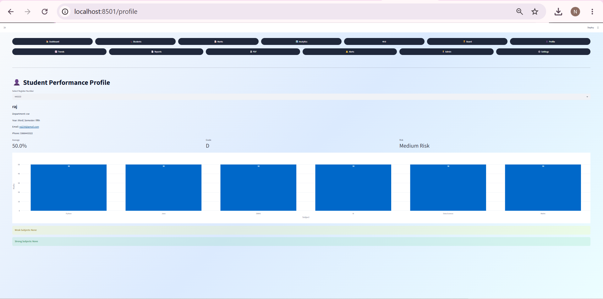

### 📈 Performance Trends
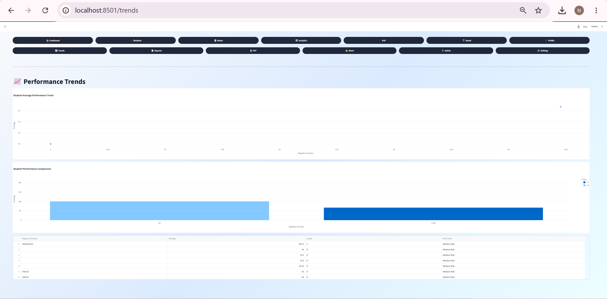

### 📄 Reports Center
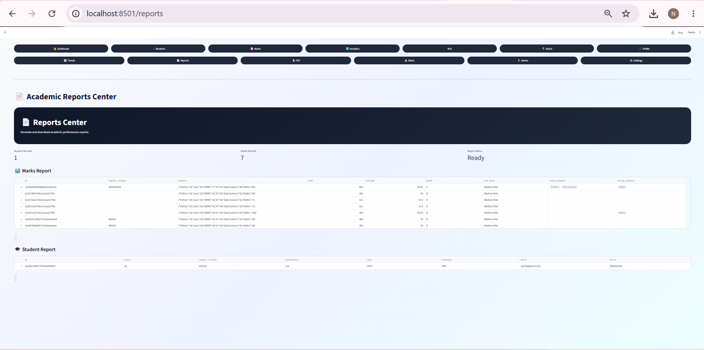

### 🧾 PDF Reports


### 🔔 Notifications
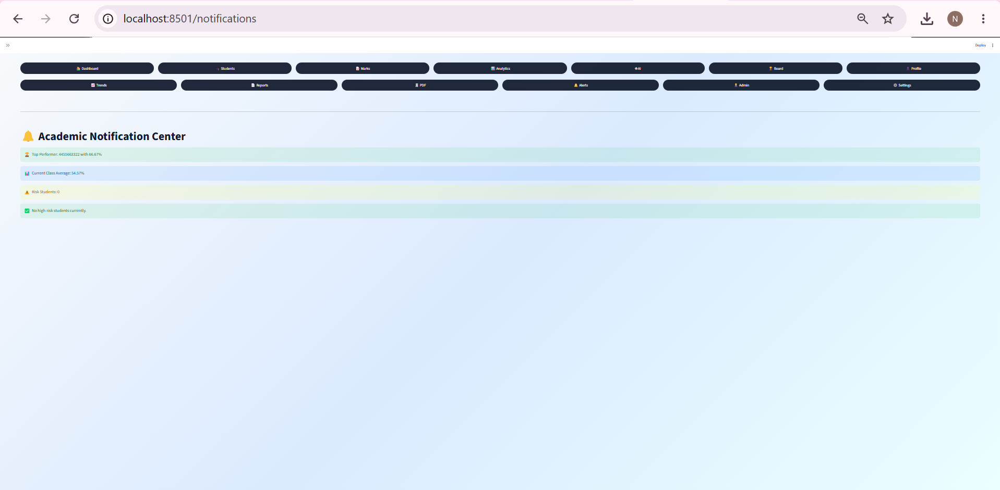

### 👨‍💼 Admin Dashboard
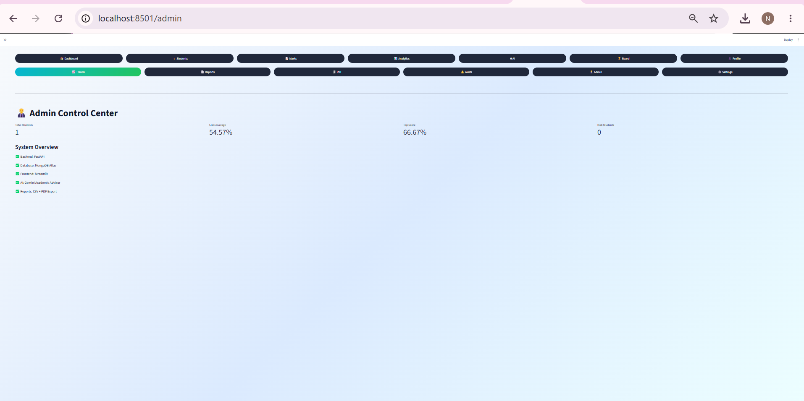

### ⚙️ Settings
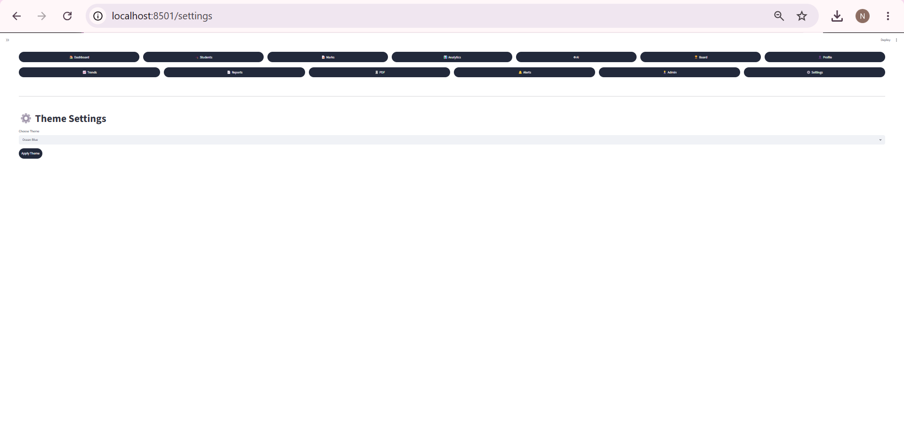

---

## ⚙️ Installation Guide

### 1. Clone Repository

```bash
git clone https://github.com/your-username/student-performance-analysis-dashboard.git
cd student-performance-analysis-dashboard

developed by:

NESHIKA.A